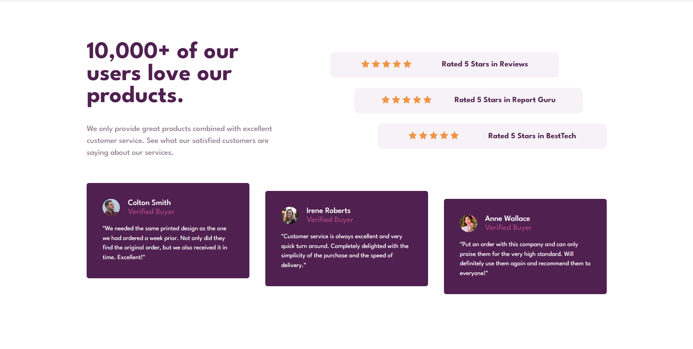
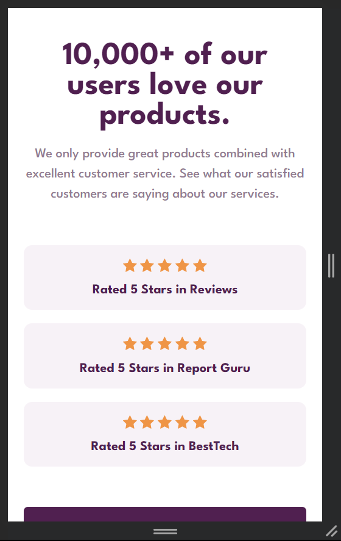
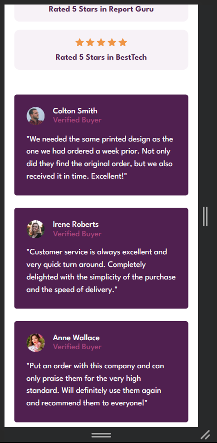

# Frontend Mentor - Social proof section solution

This is a solution to the [Social proof section challenge on Frontend Mentor](https://www.frontendmentor.io/challenges/social-proof-section-6e0qTv_bA). Frontend Mentor challenges help you improve your coding skills by building realistic projects.

## Table of contents

- [Overview](#overview)
  - [The challenge](#the-challenge)
  - [Screenshot](#screenshot)
  - [Links](#links)
- [My process](#my-process)
  - [Built with](#built-with)
  - [What I learned](#what-i-learned)
- [Author](#author)

## Overview

### The challenge

Users should be able to:

- View the optimal layout for the section depending on their device's screen size

### Screenshot

### Links

- Solution URL: https://www.frontendmentor.io/solutions/social-media-proof-solution-E4F4HkmXr6
- Live Site URL: https://fem-social-media-proof.netlify.app/

## My process

I decided to use grid areas to build this project but as I approached, I started to face difficulties with that so for now I've used template rows and columns. For reponsiveness, I've used media queries, min and clamp functions.

### Built with

- Semantic HTML5 markup
- CSS custom properties
- Flexbox
- CSS Grid

### What I learned

I have learned that I have to practice more grid layouts in order to have a full understanding about grid layout system and specially how to use grid areas properly.

## Author

- Name - Akshansh Singh
- Frontend Mentor - [@Akshansh029](https://www.frontendmentor.io/profile/akshansh029)
